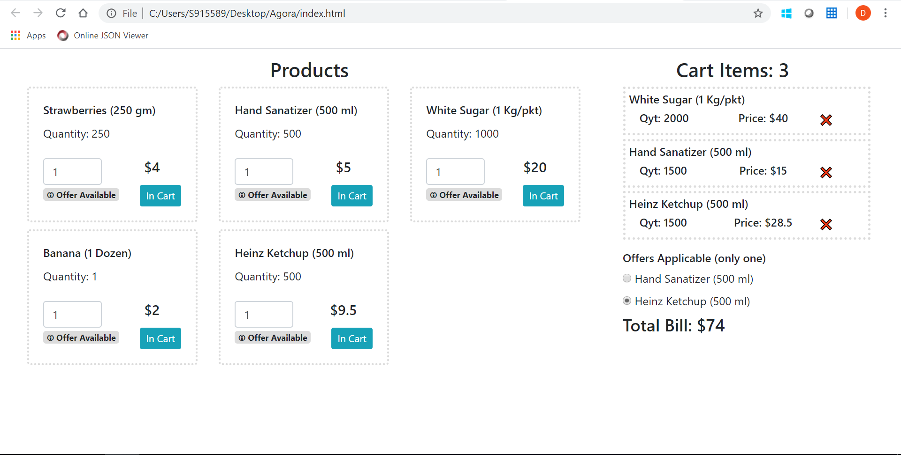

# Agora
Agora E-commerce Portal

#### To run the application (javascript, ES6)
- Double click on **index.html** in the root folder

#### To run the test cases (mocha,chai browser based)
- Go to **./tests** folder
- Double click on **index.html**

#### Features
- Well-structured program with necessary abstraction, domain focus
- Clean readable code
- Unit test Cases and code coverage

#### Folder Structure
```
|app.js
|index.html
./config
|--constants.config.js
|--errors.config.js
|--offers.config.js
./datastore
|--data.json
./handlers
|--./offers
|----buy_X_Get_Y_Free.offer.js
|----discount_X_Over_Y_Items.offer.js
|----offer.handler.js
|--cart.handler.js
|--price.handler.js
|--validation.handler.js
./tests
|--app.test.js
|--index.html
|_README.md_
```
#### Screenshots

**Main Screen**



